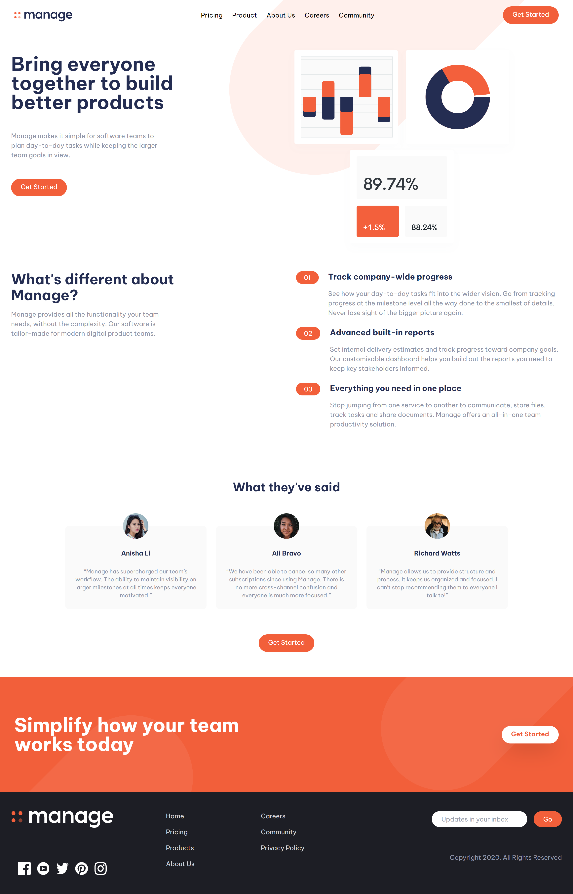

# Frontend Mentor - Manage landing page solution

This is a solution to the [Manage landing page challenge on Frontend Mentor](https://www.frontendmentor.io/challenges/manage-landing-page-SLXqC6P5). Frontend Mentor challenges help you improve your coding skills by building realistic projects. 

## Table of contents

- [Overview](#overview)
  - [The challenge](#the-challenge)
  - [Screenshot](#screenshot)
  - [Links](#links)
- [My process](#my-process)
  - [Built with](#built-with)
  - [What I learned](#what-i-learned)
- [Author](#author)

## Overview

### The challenge

Users should be able to:

- View the optimal layout for the site depending on their device's screen size
- See hover states for all interactive elements on the page

### Screenshot

### Links

- Solution URL: [Code on GitHub](https://github.com/ikennaezef/manage-landing/)
- Live Site URL: [Live site](https://ikennaezef.github.io/manage-landing/)

## My process

### Built with

- Semantic HTML5 markup
- CSS custom properties
- [Tailwind CSS](https://tailwindcss.com)
- Mobile-first workflow

### What I learned

This was my first project using tailwind CSS and so I'm getting more comfortable with it.

## Author

- Website - [My portfolio](https://ikennaezef.github.io/portfolio/)
- Frontend Mentor - [ikennaezef](https://www.frontendmentor.io/profile/ikennaezef)
